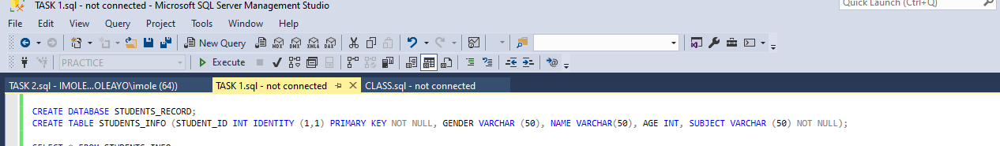
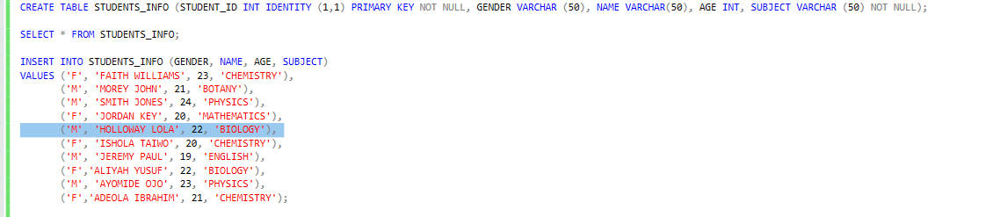
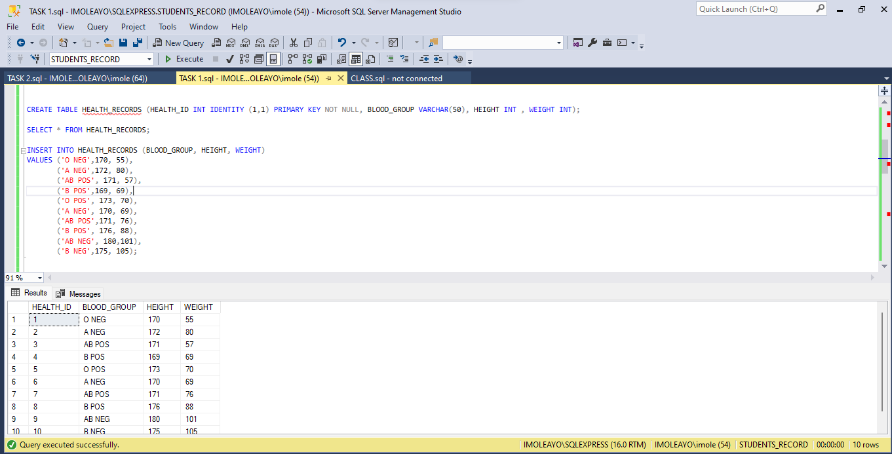
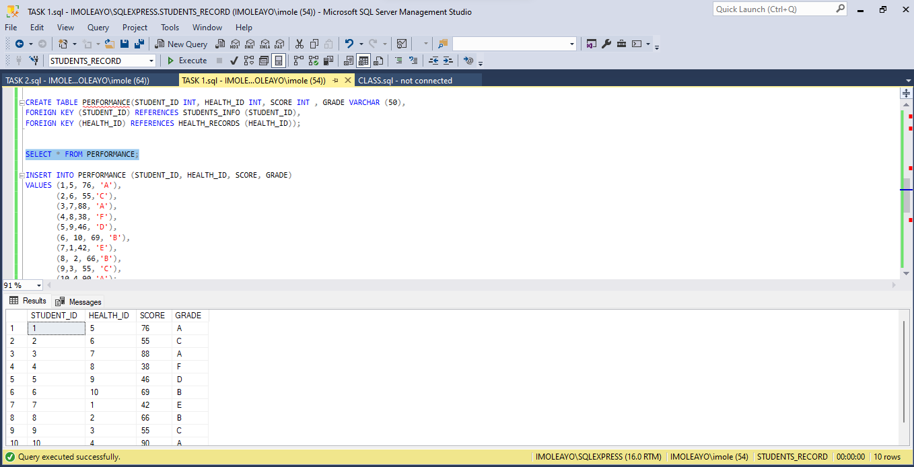
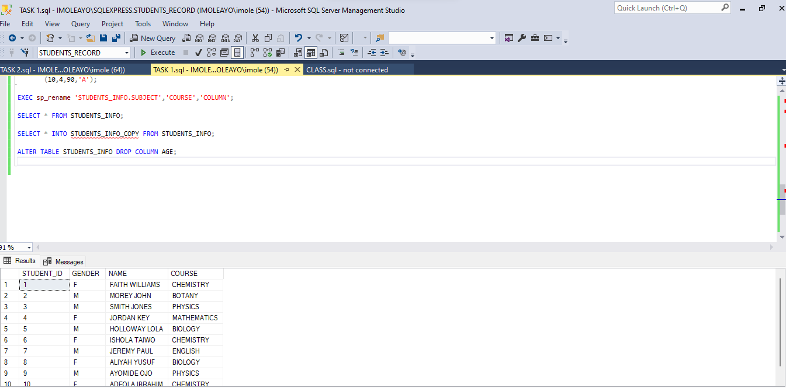

# MY FORAY INTO SQL: MY TALES

INTRODUCTION
---
This is my first task in SQL and i was told to create a database named Students Record.

This was done using the syntax -- CREATE DATABASE STUDENTS_RECORD;

CREATING TABLES
---

I then created a Table named STUDENTS_INFO with STUDENT ID as the primary key, GENDER, NAME , AGE and SUBJECT with their corresponding data types. I used the Primary key, Identity and NOT NULL constraints on the STUDENT_ID.

Then I inserted values into the table columns using - INSERT INTO STUDENTS_INFO(GENDER,NAME,AGE,SUBJECT)              
                                                      VALUES(......)

                 

I was tasked with making 2 more tables (HEALTH_RECORDS and PERFORMANCE) and followed the already outlined steps.

---

---
I introduced foreign keys into the performance table.

ALTERING TABLES
---

I was told to change column name 'Subject' to 'Course'. This was done using the syntax ----exec sp_rename 'students_info.subject','course','COLUMN';

I also deleted the Age column from the STUDENTS_INFO table using --ALTER TABLE STUDENTS_INFO DROP COLUMN AGE;
